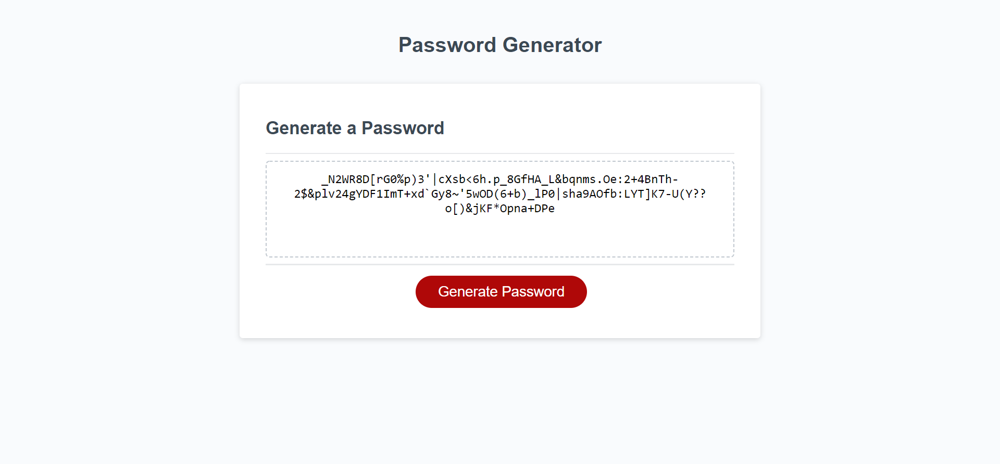

# Password-Generator

## Table of Contents

- [Password-Generator](#password-generator)
  - [Table of Contents](#table-of-contents)
  - [Description](#description)
  - [Resources](#resources)
  - [Visuals](#visuals)
  - [Authors and Acknowledgments](#authors-and-acknowledgments)

## Description

The Challenge three assignment tasked us with creating a password generator with Javascript using starter code provided by the program.

This was accomplished by using lessons from the module as well as class time to implement conditionals as well as randomness to interpret user choice and create pools of characters to generate passwords of the desired length.

## Resources

- [LIVE SITE](https://jklaver91.github.io/Password-Generator/)

- [Repository](https://github.com/Jklaver91/Password-Generator)

## Visuals

## Authors and Acknowledgments

Code created by Bootcamp, optimized by Justin Klaver.